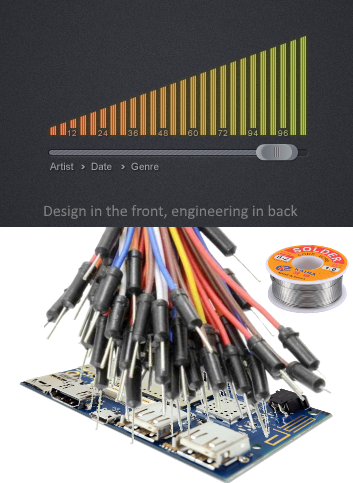

# Dragonboard Web Controls

This is a **bi-directional** way to communicate with a browser and your dragonboard. This allows you do all your embedded system work in C/C++ and all your UI in JavaScript using the power of a browser. This creates a power way to extend your Dragonboard's functionality.

## How to install on Dragonboard 410c running Debian

1. `git clone https://github.com/sjfricke/Dragonboard-Web-Controls.git`
2. `cd Dragonboard-Web-Controls`
3. `make`
4. use extra time to text your parents back

## How to use

### Start the server

After compiling the code just run `./DragonWeb` and your server will start on the Dragonboard

### Access via browser of choice

If you are running the browser **on** the Dragonboard (you have the screen plugged into the HDMI port on the board) then just go to http://localhost:8000

If you are **NOT** running the browser on the Dragonboard such as your laptop then you will need to have the Dragonboard be on the same internet network as you.
Once you are both on the same internet a simple `nmcli` will display the IP of your board.
If you didn't change any settings then the default port is 8000.

For **this example** it would be http://192168.43.41:8000

When you connect on browser you will see it display on console screen.

## How to hack with this